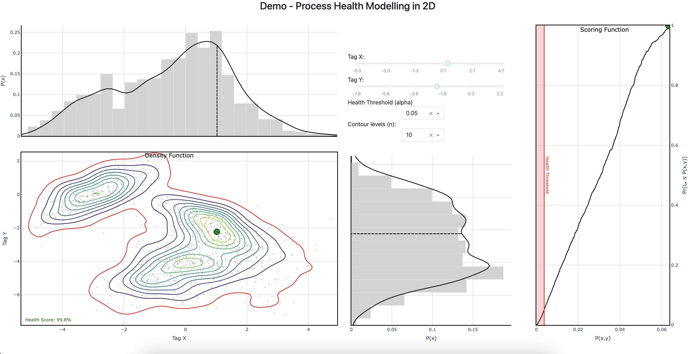
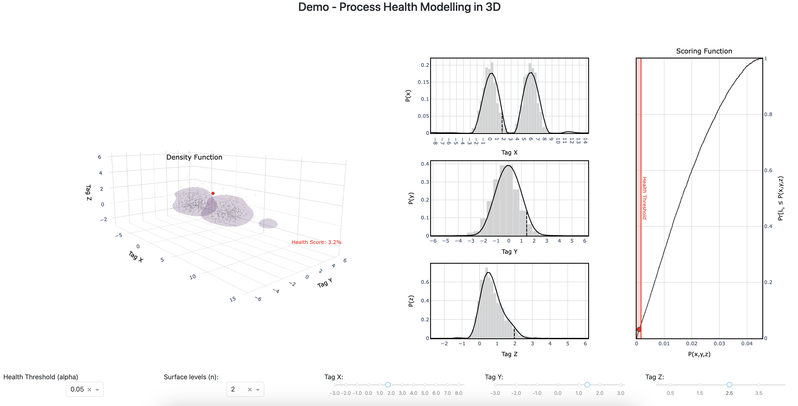

# Probability Density Functions (PDF) Likelihood Anomaly Detection - Interactive DEMOs (2D + 3D)

**2D App**

  

**3D App**

  

Setup: 
--------------------------
1. Create or activate an existing Python >= 3.7.4, <= 3.9.2 environment.
2. Create a virtual environment using conda with ``sh setup_venv.sh`` in terminal (mac OS) or Command Line (Windows)

 **Note** - built and tested using a Python >= 3.7.4, <= 3.9.2 base environment.

Running: 
--------------------------

Repository
--------------------------
This repository contains two interactive DASH app dashboards. The dashboards demonstrate anomaly detection in 2D and 3D when considering joint probability distributions. 

- **src**: Source folder containing the 2D and 3D dashboard code.
    - **dashboard_2d**:
        - **utils**:
            - ``kernel_density.py`` = Contains statsmodels.nonparametric.kernel_density.kdemultivariate class with one modification.
            - ``models.py`` = Contains both MLCV and BP11 KDE classes.
            - ``simulation.py`` = Contains functions to generate synthetic data.
        - ``main.py`` = Application is run from main.py. App configuration can be modified here.
        - ``figure_layout.py`` = static layouts for plotly graph objects.
        - ``inputs.py`` = Generates data and builds KDE estimates. 
        - ``callbacks.py`` = Contains all callback functions that enable app user interaction. 
        - ``layout.py`` = Contains all code that manages the app's HTML layout.

    - **dashboard_3d**:
        Folder structure is direct replica of **dashboard_2d**

- **requirements.txt**: .txt file that contains all of the required python libraries to run ``main.py``. 
- **setup_venv.sh**: shell script to create the virtual environment